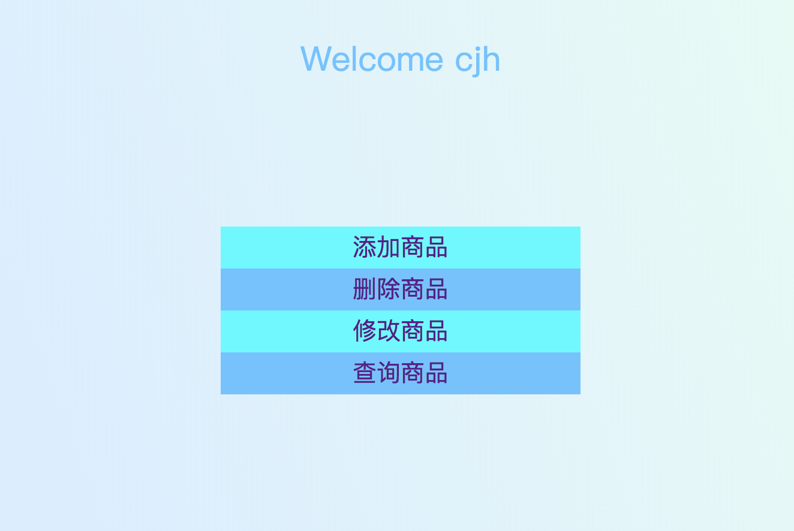
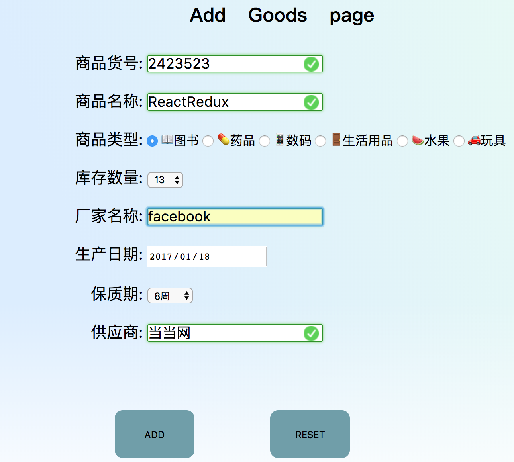
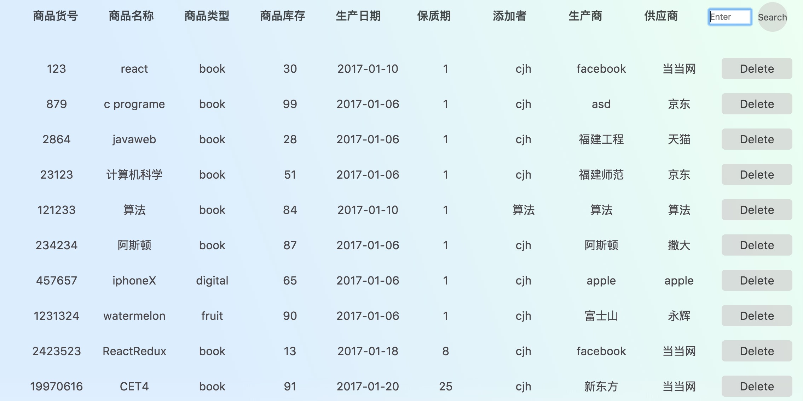
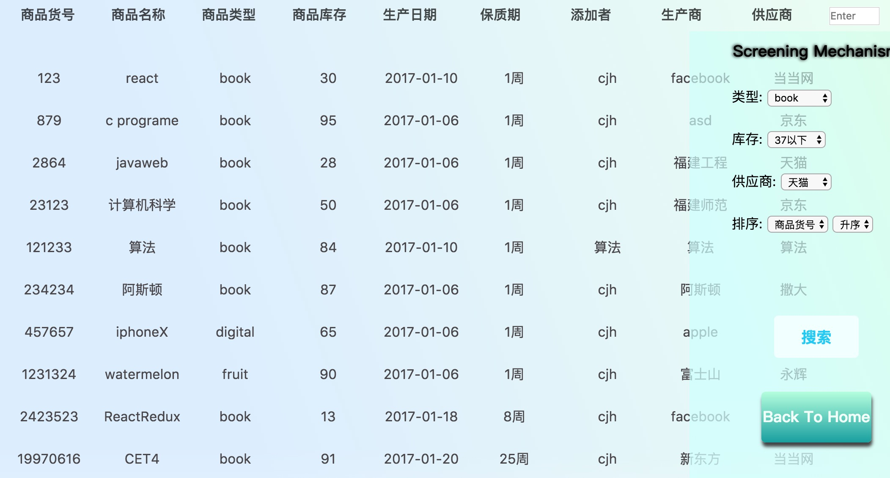
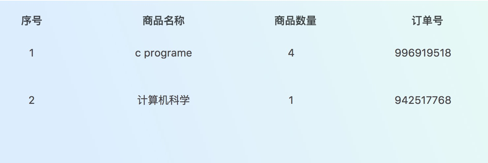

# Summary
__a small project of javaweb without framework,it extremely suitable for novices.__

__If you like,keep reading__

## javaWeb project in junior first term

### Getting Started
>As to myself,running in TomCat8.5,you can try something else

### Download project
<pre><code>
git clone https://github.com/TypeInfos/GoodsSys.git
</pre></code>

### Sql Database And Table
Database:

* userInfo

Table:

* managerInfo
* goodsInfo
* CustomerInfo
* orderInfo

**Of course,you download finder which include sql code**

### Let's preview the renderings

##### What manager can do

****

##### Enter add page

****
##### Enter delete

Well,support vague query(just is __like %'_'%__)
****
##### Enter query

Well,update is the same as above that
****
##### Now is CustomerPage

There is two option that are shopping and look up your order information

##### Shopping Page

**I set a variable of session to check shopping cart whether goods in shopping cart by placed**

**And in the login page, I set a static variable and session to judge whether the same cutomer login**
****
__Finally,you can look up current customer's order information__

